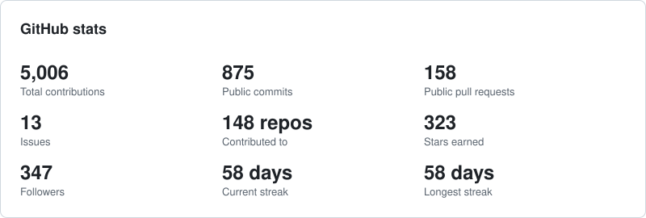
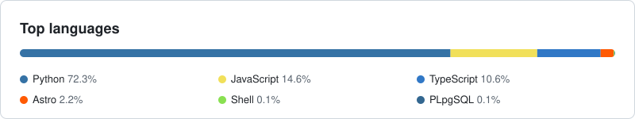

# Hi, I'm Kishor 👋

I build open tools for researchers and AI practitioners, and I study how language models and agents behave when the stakes are real.

**Research focus:** AI safety · LLM agents · NLP for low-resource languages (Bangla) · explainable AI · AI for science 
**Track record:** 80+ publications · 900+ citations · h-index 14

---

### 🔭 What I'm building

**Research tools**

| Project | What it does |
|---|---|
| [**ResearchScope**](https://github.com/kishormorol/ResearchScope) · [live](https://kishormorol.github.io/ResearchScope/) | Open research intelligence for CS papers: what matters, who drives it, what to read first, where the gaps are. Data on 🤗 [researchscope-papers](https://huggingface.co/datasets/kishormorol/researchscope-papers). |
| [**CiteLens**](https://github.com/kishormorol/CiteLens) · [live](https://kishormorol.github.io/CiteLens/) | Finds the citing papers that matter most, ranked by impact, relevance and influence. |
| [**BanglaNLP Hub**](https://github.com/kishormorol/BanglaNLP-Hub) · [live](https://kishormorol.github.io/BanglaNLP-Hub/) | Community catalog of Bangla NLP papers, datasets, models, tools and benchmarks. |
| [**GradTracker**](https://github.com/kishormorol/gradtracker) · [live](https://gradtracker-nu.vercel.app) | Community tracker for Fall 2027 PhD/MS applicants in the US and Canada: professors recruiting students and fee-waiver webinars. |

**For people who work with AI agents**

| Project | What it does |
|---|---|
| [**cli-faq-shortcuts**](https://github.com/kishormorol/cli-faq-shortcuts) | An Agent Skill that turns the asks you keep typing into short commands, mined from your own Claude Code and Codex history. Works in Claude Code, Codex and Cursor. |
| [**nightaudit**](https://github.com/kishormorol/nightaudit) | Your AI works the night shift: read-only reviews of your projects, one digest every morning. |
| [**Agent Command Atlas**](https://github.com/kishormorol/agent-command-atlas) · [live](https://kishormorol.github.io/agent-command-atlas/) | Searchable, source-linked atlas of commands, flags and shortcuts across Claude Code, Codex, Gemini CLI, Cursor, Copilot CLI and Muse Code. |
| [**SkillsAllYouNeed**](https://github.com/kishormorol/SkillsAllYouNeed) · [live](https://kishormorol.github.io/SkillsAllYouNeed/) | Directory of every first-party skill and tool across 13 AI ecosystems, including Claude, ChatGPT, Gemini, Codex, Cursor and Copilot. |
| [**promptlean**](https://github.com/kishormorol/promptlean) · [live](https://kishormorol.github.io/promptlean/) | Token-efficient prompt library, each prompt in Lean, Balanced and Max Quality variants. |
| [**blast-radius**](https://github.com/kishormorol/blast-radius) | An Agent Skill for the moment before a bulk write: classify every affected row before touching any of them. |

**Research code**

| Project | Question |
|---|---|
| [**agent-repair**](https://github.com/kishormorol/agent-repair) | When a multi-step LLM agent fails, where should recovery begin: repair the trajectory or restart? |
| [**alexa-language-bridge**](https://github.com/kishormorol/alexa-language-bridge) | An Alexa+ MCP add-on that lets a household member who doesn't speak English use the home in their own language and script. |
| [**bangla-multimodal-political-stance**](https://github.com/kishormorol/bangla-multimodal-political-stance) | Can the headline and the photo together tell which way a Bangla news story leans toward the government? |
| [**banglachhanda**](https://github.com/kishormorol/banglachhanda) | Can Bangla meter (chhanda) be scanned by rule? An annotation guideline, a scanner baseline and a pilot corpus. |

---

### 📊 Open data on Hugging Face

| Dataset | Rows | License |
|---|---|---|
| [**researchscope-papers**](https://huggingface.co/datasets/kishormorol/researchscope-papers) | 100,000+ CS papers, scored and sectioned | CC BY 4.0 |
| [**bangla-nlp-catalog**](https://huggingface.co/datasets/kishormorol/bangla-nlp-catalog) | 712 papers, 63 datasets, 20 models, 9 tools for Bangla NLP | MIT |
| [**llm-skills-registry**](https://huggingface.co/datasets/kishormorol/llm-skills-registry) | 226 first-party AI skills across 13 ecosystems | CC BY 4.0 |
| [**promptlean-prompts**](https://huggingface.co/datasets/kishormorol/promptlean-prompts) | 120 prompts × 3 token-efficiency variants | MIT |
| [**banglachhanda**](https://huggingface.co/datasets/kishormorol/banglachhanda) | 153 Bangla poems (7,009 lines) plus a 316-line scansion pilot, not yet gold | CC BY-SA 4.0 |

The web tools above also run as 🤗 Spaces: [ResearchScope](https://huggingface.co/spaces/kishormorol/ResearchScope) · [CiteLens](https://huggingface.co/spaces/kishormorol/CiteLens) · [BanglaNLP Hub](https://huggingface.co/spaces/kishormorol/BanglaNLP-Hub) · [Agent Command Atlas](https://huggingface.co/spaces/kishormorol/agent-command-atlas) · [SkillsAllYouNeed](https://huggingface.co/spaces/kishormorol/SkillsAllYouNeed) · [promptlean](https://huggingface.co/spaces/kishormorol/promptlean)

---

### 📈 GitHub stats

<picture>
  <source media="(prefers-color-scheme: dark)" srcset="assets/stats-dark.svg">
  
</picture>

<picture>
  <source media="(prefers-color-scheme: dark)" srcset="assets/langs-dark.svg">
  
</picture>

Refreshed daily by a GitHub Action. Languages leave out HTML, CSS, notebooks and TeX.

---

### 🤝 Get in touch

Open to research collaborations and contributors on any of the projects above. Issues and PRs are welcome.

