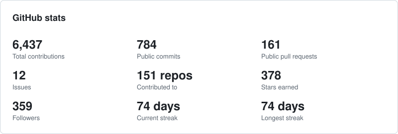
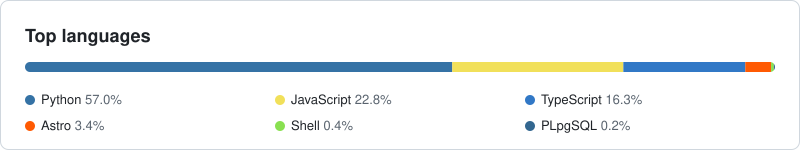

# Hi, I'm Kishor 👋

📍 **New York** | 🔬 **AI Safety & Agents Researcher** | 🛠️ **Open-Source Builder**

I build open tools for researchers and study how language models behave when the stakes are real.

## Start Here

- 🔭 **[ResearchScope](https://kishormorol.github.io/ResearchScope/)** (110+ ⭐) — open research intelligence for CS papers: what matters, who drives it, what to read first
- ⚡ **[cli-faq-shortcuts](https://github.com/kishormorol/cli-faq-shortcuts)** (116+ ⭐) — turn repeated prompts into slash commands, mined from your own Claude Code history
- 🌙 **[nightaudit](https://github.com/kishormorol/nightaudit)** (30+ ⭐) — your AI works the night shift: read-only reviews, one digest every morning
- 🧭 **[Agent Command Atlas](https://kishormorol.github.io/agent-command-atlas/)** (24+ ⭐) — searchable atlas of commands across 6 AI coding agents
- 🎯 **[SkillsAllYouNeed](https://kishormorol.github.io/SkillsAllYouNeed/)** (25+ ⭐) — directory of every first-party skill across 13 AI ecosystems

## Current Projects

### Research Tools & Platforms

- 🔭 **[ResearchScope](https://kishormorol.github.io/ResearchScope/)** — open research intelligence for CS papers, with data on 🤗 [researchscope-papers](https://huggingface.co/datasets/kishormorol/researchscope-papers)
- 🔍 **[CiteLens](https://kishormorol.github.io/CiteLens/)** — finds the citing papers that matter most, ranked by impact and influence
- 🇧🇩 **[BanglaNLP Hub](https://kishormorol.github.io/BanglaNLP-Hub/)** — community catalog of Bangla NLP papers, datasets, models and benchmarks
- 🎓 **[GradTracker](https://gradtracker-nu.vercel.app)** — community tracker for Fall 2027 PhD/MS applicants: professor openings and fee-waiver webinars

### AI Agent Tools & Skills

- ⚡ **[cli-faq-shortcuts](https://github.com/kishormorol/cli-faq-shortcuts)** — turn repeated Claude Code, Codex and Cursor prompts into reusable slash commands
- 🌙 **[nightaudit](https://github.com/kishormorol/nightaudit)** — read-only reviews of your projects while you sleep, one digest every morning
- 🧭 **[Agent Command Atlas](https://kishormorol.github.io/agent-command-atlas/)** — searchable atlas of commands, flags and shortcuts across Claude Code, Codex, Gemini CLI, Cursor, Copilot CLI and Muse Code
- 🎯 **[SkillsAllYouNeed](https://kishormorol.github.io/SkillsAllYouNeed/)** — every first-party skill and tool across 13 AI ecosystems
- 📐 **[promptlean](https://kishormorol.github.io/promptlean/)** — token-efficient prompt library: 120 prompts, 3 variants each (Lean / Balanced / Max Quality)
- 💥 **[blast-radius](https://github.com/kishormorol/blast-radius)** — agent skill: classify every affected row before a bulk write touches any of them
- 🔁 **[promptalias](https://kishormorol.github.io/promptalias/)** — reusable prompts as Agent Skills for Claude Code, Codex and Cursor
- 🧰 **[ECC](https://ecc.tools)** — agent harness performance optimization: skills, instincts, memory and security

### Research Code

- 🔧 **[agent-repair](https://github.com/kishormorol/agent-repair)** — when a multi-step LLM agent fails, where should recovery begin: repair or restart?
- 🗣️ **[alexa-language-bridge](https://github.com/kishormorol/alexa-language-bridge)** — Alexa+ MCP add-on for non-English household members
- 📰 **[bangla-multimodal-political-stance](https://github.com/kishormorol/bangla-multimodal-political-stance)** — can the headline + photo predict Bangla news political leaning?
- 📜 **[banglachhanda](https://github.com/kishormorol/banglachhanda)** — rule-based Bangla meter (chhanda) scanning: guidelines, baseline, pilot corpus
- 🧠 **[adaptive-ai-scaffold](https://github.com/kishormorol/adaptive-ai-scaffold)** — AI writing tools that scaffold student reasoning instead of answering for them

## Open Data on Hugging Face

| Dataset | What's inside | License |
|---|---|---|
| [**researchscope-papers**](https://huggingface.co/datasets/kishormorol/researchscope-papers) | 100,000+ CS papers, scored and sectioned | CC BY 4.0 |
| [**bangla-nlp-catalog**](https://huggingface.co/datasets/kishormorol/bangla-nlp-catalog) | 712 papers, 63 datasets, 20 models, 9 tools | MIT |
| [**llm-skills-registry**](https://huggingface.co/datasets/kishormorol/llm-skills-registry) | 226 first-party AI skills across 13 ecosystems | CC BY 4.0 |
| [**promptlean-prompts**](https://huggingface.co/datasets/kishormorol/promptlean-prompts) | 120 prompts × 3 token-efficiency variants | MIT |
| [**banglachhanda**](https://huggingface.co/datasets/kishormorol/banglachhanda) | 153 Bangla poems (7,009 lines), scansion pilot | CC BY-SA 4.0 |

Also on 🤗 Spaces: [ResearchScope](https://huggingface.co/spaces/kishormorol/ResearchScope) · [CiteLens](https://huggingface.co/spaces/kishormorol/CiteLens) · [BanglaNLP Hub](https://huggingface.co/spaces/kishormorol/BanglaNLP-Hub) · [Agent Command Atlas](https://huggingface.co/spaces/kishormorol/agent-command-atlas) · [SkillsAllYouNeed](https://huggingface.co/spaces/kishormorol/SkillsAllYouNeed) · [promptlean](https://huggingface.co/spaces/kishormorol/promptlean)

## GitHub Activity

<picture>
  <source media="(prefers-color-scheme: dark)" srcset="assets/stats-dark.svg">
  
</picture>

<picture>
  <source media="(prefers-color-scheme: dark)" srcset="assets/langs-dark.svg">
  
</picture>

Refreshed daily by a GitHub Action. Languages exclude HTML, CSS, notebooks and TeX.

## What I'm Doing

- **Researching AI safety** — how LLM agents fail, recover, and misbehave in multi-step settings
- **Building open research infra** — tools that help researchers find what matters without a paywall
- **Bridging Bangla NLP** — datasets, benchmarks and tools for a language with 300M+ speakers and limited resources
- **Teaching agents to be useful** — skills, commands and workflows that make AI coding agents practical

## Recognition

- **80+ publications** · **900+ citations** · **h-index 14** on [Google Scholar](https://scholar.google.com/citations?user=pjn3jg4AAAAJ)
- Open datasets powering research on [Hugging Face](https://huggingface.co/kishormorol)
- Tools used across Claude Code, Codex, Cursor and Gemini CLI ecosystems

## Connect

---

> "Build the tool you wish existed, then give it away." — I make open research and agent tools because the best work happens when everyone has access.

Random Facts

- 80+ papers and still shipping code
- Run multiple Claude instances concurrently (it's a lifestyle)
- Bangla is my first language — building NLP for it is personal
- Powered by late-night coding sessions and strong coffee

